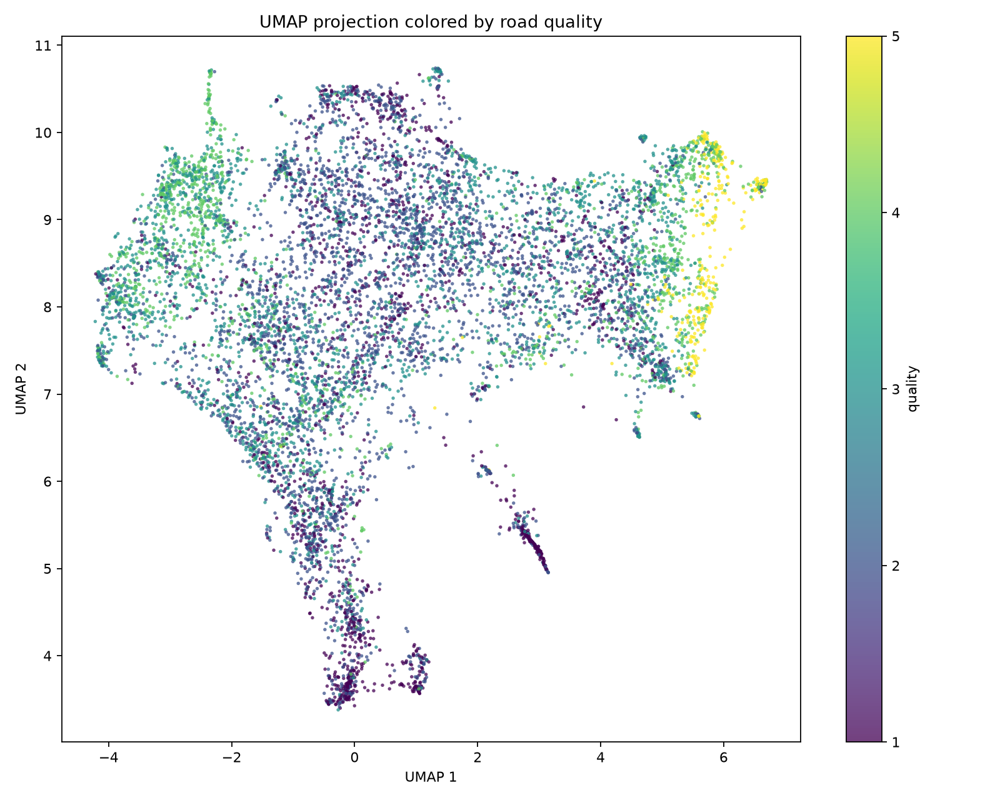

# Tarmac — Road Surface Quality Analysis

Tarmac analyzes photos and videos of road surfaces (asphalt/tarmac, concrete, paving stones, sett, unpaved) and grades their **quality** on a 1–5 scale (1 = excellent, 5 = very bad). It works by turning every image — and every road tile within it — into an embedding vector, then classifying it against a reference set of tens of thousands of labelled surfaces using cosine similarity. The result lets you map how road quality changes along a street and see which sections are good and which are failing.

## What the quality space looks like

Each dot below is one road image, projected from a 768-dimensional embedding down to 2-D with UMAP and coloured by its quality grade (purple = excellent → yellow = very bad). A good model should arrange images so that similar-quality surfaces sit together.

| Off-the-shelf backbone (frozen) | After supervised-contrastive fine-tuning |
| --- | --- |
|  |  |
| Quality grades are smeared across the space — the raw backbone tells *what* a surface is, but not *how good* it is. | After fine-tuning, quality forms clear regions: very-bad/unpaved (yellow) breaks off into its own island, excellent asphalt (purple) clusters on the right. New images land in the right neighbourhood. |

This separation is what makes cosine-similarity classification reliable: a new photo is embedded, and its nearest neighbours in this space vote on its quality and surface type.

## How it works

```
photo / video frame
   │
   ├─ split into road tiles (3×2 grid over the lower half of the frame)
   │
   ▼
DINOv3 ViT-B/16 backbone  ──►  768-d embedding per tile  (L2-normalised)
   │                                   │
   │                                   ▼
   │                          FAISS cosine index of ~9k labelled reference tiles
   │                                   │
   ▼                                   ▼
per-tile prediction  ◄──  k-NN vote (quality 1–5, surface type, confidence)
   │
   ▼
per-frame result = median quality of road tiles, majority surface type
   │
   ▼
report:  quality-along-the-street timeline · UMAP scatter · GPS map · gallery
```

1. **Tiling.** Full frames contain sky, cars and buildings, so each frame is cut into a 3×2 grid of tiles over the lower (road) half. Quality is judged per tile and aggregated, and tiles that don't look like any road surface are dropped as *non-road*.
2. **Embedding.** A [DINOv3 ViT-B/16](https://huggingface.co/facebook/dinov3-vitb16-pretrain-lvd1689m) vision transformer turns each tile into a 768-dimensional vector. DINOv3 is a strong texture/structure encoder out of the box; we fine-tune the last 4 transformer blocks.
3. **Fine-tuning.** A **supervised-contrastive loss** pulls together tiles that share the same (surface type, quality) label and pushes apart those that differ. This is what turns the left scatter above into the right one. Training runs on Apple-Silicon GPU (MPS), checkpoints every epoch, and stops early on the best validation score.
4. **Classification.** New tiles are matched against the labelled reference set with **cosine k-NN** (FAISS inner-product index over normalised vectors). The reference set's k-means clusters also let you find "similar surfaces" by nearest centroid.
5. **Reporting.** Per-frame results become an HTML report: quality over time/distance, a UMAP scatter of the analysed frames inside the reference space, an EXIF-GPS map when available, and a thumbnail gallery.

Why not reinforcement learning or a world model? The task is *representation learning + metric classification*, not sequential decision-making — there is no agent or reward. A vision transformer embedding space, fine-tuned contrastively, is the direct fit. See [`PLAN.md`](PLAN.md) for the full rationale and roadmap.

## Results

Cosine k-NN (k=10) classification on the held-out validation + test split of [StreetSurfaceVis](https://zenodo.org/records/11449977) (9,122 images). "Off-by-one" is the share of quality predictions within one grade of the truth.

| Model | Surface type acc / F1 | Quality acc / F1 | Quality MAE | Off-by-one | Silhouette (type+quality) |
| --- | --- | --- | --- | --- | --- |
| DINOv2 frozen | 0.798 / 0.674 | 0.470 / 0.465 | 0.62 | 0.911 | −0.028 |
| DINOv3 frozen | 0.813 / 0.680 | 0.490 / 0.485 | 0.58 | 0.939 | −0.024 |
| DINOv2 fine-tuned | 0.954 / **0.895** | 0.671 / 0.647 | 0.33 | 0.996 | **0.069** |
| **DINOv3 fine-tuned** (active) | 0.954 / 0.873 | 0.666 / **0.664** | 0.34 | **0.999** | 0.020 |

Fine-tuning is the decisive step: surface-type accuracy rises from ~0.80 to **0.954** and quality macro-F1 from ~0.47 to **0.66**, with quality errors almost always just one adjacent grade (off-by-one ≈ **99.9%**). The active model — fine-tuned DINOv3 — is recorded in `models/active_model.json`. Full breakdown in [`reports/PHASE3_FINETUNE.md`](reports/PHASE3_FINETUNE.md).

## Capabilities & results

Worked examples on license-safe imagery (StreetSurfaceVis + CrackAirport). Full gallery with metrics and attribution: [`reports/RESULTS.md`](reports/RESULTS.md).

### Surface type + quality grading
Each tile is classified by cosine k-NN against the fine-tuned DINOv3 reference set. Labels show `pred type / predQ (trueQ)` — surface type **0.954** accuracy, quality off-by-one **0.999**.


### Pixel-precise crack segmentation + measurement
`tarmac crack-measure` traces the exact crack pixels and computes crack **area** and **length**. Left to right: original · ground-truth mask (CrackAirport) · our predicted overlay with area %/length.


### Runway / airport full-frame crack detection
Top-down airport pavement has no sky, so `--region full` analyses the whole image (not just the lower half) and overlays detected cracks.


### Structural defect detection (multi-domain)
The multi-label defect head predicts `crack`, `spalling`, `efflorescence`, `exposed_rebar`, and `corrosion` on the same DINOv3 tile embeddings. Headline test AP is **0.987 / 0.966 / 0.968 / 0.986 / 0.898** in that label order; bridge is the only domain with all five labels, and corrosion is the weakest class.


### Condition assessment + repair priority
`tarmac assess` runs the existing analyzer, then aggregates quality grade, crack geometry, and defect signals into a per-frame PCI-like visual proxy. The output is `assessment.json` plus `assessment.parquet`; the HTML report adds a **Condition assessment** section with per-frame grade, priority, and rationale.

This is **not** official ASTM D6433 PCI. It does not measure binder content, density/air voids, or water-damage progression; those remain lab/instrumented/time-series targets.

| Frame | Condition | Descriptor | Repair priority | Key defects |
| ---: | ---: | --- | --- | --- |
| 0 | 2 | Satisfactory | none | none |
| 1 | 3 | Fair | monitor | crack |
| 2 | 4 | Poor | plan_repair | crack, spalling |

### Cracked-section flagging & vector-space visualization
Tile-level crack flags (left) mark which sections are cracked; `tarmac visualize` (right) projects any folder into the reference embedding space with click-to-view images.

| Cracked sections | Folder in embedding space |
| --- | --- |
|  |  |

Mobile/real-time YOLO results: [`reports/YOLO_MOBILE.md`](reports/YOLO_MOBILE.md).

## Quickstart

```bash
uv sync                                  # create env + install deps
uv run tarmac download streetsurfacevis  # fetch the reference dataset (~2.4 GB)
uv run tarmac prepare                     # build the unified manifest
```

Datasets and model checkpoints are **not** committed to git (see `.gitignore`); the commands above reproduce them locally.

### Analyze photos or video

```bash
# A single photo, a directory of images, or a video.
uv run tarmac analyze path/to/photo.jpg
uv run tarmac analyze path/to/images --out runs/my-road
uv run tarmac analyze path/to/video.mp4 --fps 2 --out runs/my-video
uv run tarmac analyze path/to/runway-images --region full
```

Video requires `ffmpeg` (`brew install ffmpeg`). Each run writes `results.parquet`, `tiles.parquet`, `summary.json` and thumbnails into the run directory. Region mode defaults to `--region auto`: it classifies a coarse full-frame 3x3 grid and uses lower-half tiles for street scenes with sky/non-road in the top row, otherwise full-frame 3x3 tiles for top-down runway/pavement images. Use `--region lower_half` or `--region full` to force the mode.

### Generate an HTML report

```bash
uv run tarmac report runs/my-video      # -> runs/my-video/report.html
```

Headline stats, a quality timeline, cracked-section overlays when a crack head is present, crack geometry overlays when segmentation ran, a UMAP scatter of the run inside the reference space, a GPS map (when EXIF GPS exists), and a thumbnail gallery.

### Run condition assessment

```bash
UV_CACHE_DIR=.uv-cache uv run tarmac assess path/to/images --device cpu --mm-per-pixel 0.5 --out runs/my-assessment
UV_CACHE_DIR=.uv-cache uv run tarmac report runs/my-assessment
```

The assessment layer reuses `tarmac analyze`; it does not train or duplicate model code. It writes `assessment.json`, `assessment.parquet`, and a report-ready condition summary with repair priorities `none`, `monitor`, `plan_repair`, and `urgent`.

### Crack & runway detection

Crack detection is a separate binary track from the 1-5 quality grader. Crack datasets do not carry quality labels, so the crack head is trained independently on frozen active-backbone embeddings and is applied per tile during `tarmac analyze`.

```bash
uv run tarmac download cracks-concrete-pavement
uv run tarmac download crack500          # optional mask dataset mirror
uv run tarmac download deepcrack         # optional mask dataset mirror
uv run tarmac download runway-roboflow   # requires ROBOFLOW_API_KEY
uv run tarmac prepare-cracks
uv run tarmac train-crack                # requires Apple MPS; no CPU fallback
uv run tarmac evaluate-crack
```

When `models/crack_head.pt` exists, `tarmac analyze` adds `tile_crack_prob` and `tile_crack` to `tiles.parquet`, plus per-frame `crack_ratio` and `frame_has_crack` in `results.parquet`. `tarmac report` then includes a **Cracked sections** panel with a crack-ratio timeline and red tile overlays showing which road/runway sections are cracked.

Pixel-level crack geometry is available without mask training data through a hybrid segmenter: crack-head sliding-window localization plus classical dark thin-ridge extraction (`frangi`/`sato` vesselness, black-hat morphology, cleanup, skeleton measurements). It produces full-resolution red mask overlays and measures area, length, mean width, max width, and component count.

```bash
uv run tarmac crack-measure path/to/image-or-dir --out runs/crack-geometry
uv run tarmac crack-measure path/to/image-or-dir --mm-per-pixel 0.5 --out runs/crack-geometry-mm
uv run tarmac analyze path/to/runway.jpg --region full --crack-segmentation --mm-per-pixel 0.5
```

`analyze` also runs crack segmentation automatically when a crack head exists and the selected region is `full`. Geometry columns include `crack_area_px`, `crack_area_pct`, `crack_length_px`, `crack_mean_width_px`, and metric variants when `--mm-per-pixel` is provided. See `reports/CRACK_SEGMENTATION.md`.

Runway-specific Roboflow data is integrated through the Roboflow REST API and requires a free API key:

```bash
export ROBOFLOW_API_KEY=...
uv run tarmac download runway-roboflow
uv run tarmac prepare-cracks
```

Get the key from Roboflow account settings. The downloader uses the Roboflow REST API for `revathi-deusp/runway-crack-detection-1iq1l` and converts crack/mildcrack/severecrack bounding boxes into tile-level crack labels. Current held-out runway-only metrics are: validation F1 `0.9130`, ROC-AUC `0.9156`; test F1 `0.9091`, ROC-AUC `0.9841`. See `reports/CRACK_DETECTION.md` for the full per-source table.

Caveats for runway use: the current Roboflow pull is small (40 annotated images → ~240 tiles), so runway-only metrics are directionally useful but not statistically strong; add more runway imagery to harden them. Top-down/drone runway imagery should use `--region full` or the default `--region auto`, which now selects full-frame tiles when the top row looks like pavement rather than sky/non-road.

### Structural defect detection (multi-domain)

Phase 9 adds a multi-label structural-condition head on frozen active DINOv3 embeddings for `crack`, `spalling`, `efflorescence`, `exposed_rebar`, and `corrosion`. It uses the unified defect manifest across bridge, building, pavement, runway, and generic concrete domains. The embedding cache includes every row with any defect label plus a seed-42 stratified sample of 20,000 pure-`none` negatives.

```bash
uv run tarmac prepare-defects
uv run tarmac embed-defects              # requires Apple MPS; no CPU fallback
uv run tarmac train-defect               # 768 -> 512 -> 5 multi-label head
uv run tarmac evaluate-defect
```

Held-out test AP / F1: crack `0.9868 / 0.9393`, spalling `0.9660 / 0.8953`, efflorescence `0.9675 / 0.9325`, exposed rebar `0.9863 / 0.9593`, corrosion `0.8982 / 0.8513`. Test domain macro-F1: bridge `0.8975`, pavement `0.8996`, building `0.8768`, runway `0.8990`, concrete-generic `0.9986`. Full tables are in [`reports/DEFECT_DETECTION.md`](reports/DEFECT_DETECTION.md).

When `models/defect_head.pt` exists, `tarmac analyze` adds per-tile `tile_defect_<label>_prob` and `tile_defect_<label>` columns to `tiles.parquet`, plus per-frame `defect_<label>_ratio`, `frame_has_defect_<label>`, `structural_defects`, and `frame_has_structural_defect` columns to `results.parquet`. The HTML report includes a **Structural defects** panel listing detected defect types per frame.

The committed gallery image uses CrackAirport imagery for the crack case only. CODEBRIM bridge imagery is not committed because Zenodo record `2620293` reports license id `other-nc`; the non-crack bridge-defect results are shown in the metrics table in [`reports/RESULTS.md`](reports/RESULTS.md).

### Licensing & commercial use

Surface-quality and crack-specific capabilities are based on CC-licensed sources, subject to attribution/share-alike obligations. The non-crack structural defect labels are CODEBRIM-backed and marked non-commercial/research-only. See [`reports/DATA_LICENSES.md`](reports/DATA_LICENSES.md) before using the trained heads commercially.

### Mobile / real-time (YOLO)

Phase 8 adds small YOLO11 students for mobile and edge deployment. The fine-tuned DINOv3 model remains the high-accuracy server-side teacher; YOLO is trained from labels, with an optional future distillation hook, and exported separately. It is not a conversion of DINOv3 weights.

```bash
# CrackAirport airport-pavement masks -> YOLO segmentation
uv run tarmac download crackairport
uv run tarmac yolo-prep-seg
uv run tarmac yolo-train-seg --model yolo11n-seg.pt
uv run tarmac yolo-export --task seg

# StreetSurfaceVis road tiles -> YOLO classification students
uv run tarmac yolo-prep-cls
uv run tarmac yolo-train-cls --target type
uv run tarmac yolo-train-cls --target quality
uv run tarmac yolo-export --task cls_type
uv run tarmac yolo-export --task cls_quality

# Benchmark and crack overlay inference
uv run tarmac yolo-benchmark
uv run tarmac yolo-detect path/to/runway-or-road-images --out runs/yolo_detect
```

Training is MPS-only by design (`device=mps`); if Apple MPS is unavailable, YOLO training fails loudly instead of silently falling back to CPU. Final full-training headline on this M3 Max: selected YOLO11n-seg crack segmentation reaches mask mAP50 `0.1853` / mAP50-95 `0.0389` and runs at `18.6 ms` CPU / `5.5 ms` MPS per image; YOLO11s-seg was also trained and tested lower at mask mAP50 `0.1536` / mAP50-95 `0.0293`. YOLO11n-cls type reaches top-1 `0.8436` vs DINOv3 `0.954`; YOLO11s-cls quality is kept as the better quality model with top-1 `0.5026` and off-by-one `0.9459` vs DINOv3 off-by-one `0.999`. On `/tmp/tarmac_runway_test`, YOLO detection correctly handled `10/12` images (`9/10` cracked detected, `1/2` non-cracked rejected). See `reports/YOLO_MOBILE.md` and `reports/yolo_benchmark.json`.

Deploy the ONNX files with ONNX Runtime Mobile for Android/edge inference. CoreML export was enabled with `coremltools`, but Ultralytics conversion failed for all three models with `only 0-dimensional arrays can be converted to Python scalars`, so this run does not include iOS `.mlpackage` artifacts. TensorFlow/TFLite export was intentionally not attempted on this Mac because the TensorFlow toolchain is heavy and fragile here; ONNX covers the Android path.

### Visualize a folder of images in the vector space

```bash
uv run tarmac visualize path/to/folder  # -> reports/visualize_<folder>.html
```

Plots every image in the folder against the gray reference cloud, coloured by predicted quality. **Click any dot to open a dialog showing that image**, its filename and predicted grade. Self-contained HTML — open it straight from disk.

### Interactive UI

```bash
uv run tarmac ui                         # Streamlit app
```

Upload a photo/video or point at a local path, run the pipeline, and browse the table, charts and downloadable report in the browser.

## Datasets

| Dataset | Size | Labels | Role |
| --- | --- | --- | --- |
| [StreetSurfaceVis](https://zenodo.org/records/11449977) | 9,122 | surface type × quality (excellent→very bad) | Primary — trained & evaluated here |
| [RSCD](https://thu-rsxd.com/rscd/) | 1M | material × unevenness × friction | Scale-up (downloader included) |
| [RTK](https://data.mendeley.com/datasets/fxy5khmhpb/1) | 77,547 | asphalt/paved/unpaved + defects | Scale-up (downloader included) |
| [Concrete & Pavement Crack](https://data.mendeley.com/datasets/429vzbgmbx/1) | 30,000 | crack / non-crack | Crack classifier head |
| [CrackAirport](https://data.mendeley.com/datasets/3v5r2fxf89/1) | 2251 image/mask pairs in current v1 archive | airport pavement crack masks | YOLO mobile crack segmentation |
| [CRACK500](https://github.com/fyangneil/pavement-crack-detection), [DeepCrack](https://github.com/yhlleo/DeepCrack) | masks | pixel crack masks | Crack mask data, downloadable |
| Roboflow runway crack detection | 40 images / 240 tiles in current pull | runway crack bounding boxes | Runway-specific crack labels with `ROBOFLOW_API_KEY` |

## Project layout

```
src/tarmac/
  datasets/   downloaders + unification to one manifest
  embedding/  DINOv3 embedder, road tiling
  train/      supervised-contrastive fine-tuning
  cluster/    k-means / HDBSCAN, cosine assignment
  defect/     multi-domain structural defect embedding cache + head
  eval/       accuracy, F1, silhouette, UMAP scatter
  inference/  photo/video analysis, folder visualization
  yolo/       mobile YOLO dataset prep, training, export, detect, benchmark
  report/     HTML report + click-to-view UMAP scatter
  ui/         Streamlit app
reports/      committed metrics + visualizations
PLAN.md       full architecture, decisions and phase plan
```

## Roadmap

Built so far: data pipeline, embeddings, contrastive fine-tuning, clustering, evaluation, inference, reports, folder visualization, UI, Phase 7 crack/runway analysis, Phase 8 full-training YOLO mobile students, Phase 9 multi-domain structural defect detection, and Phase 10 condition assessment with licensing labels. Next (see `PLAN.md`): resolve native CoreML export, add more non-crack structural datasets, and consider defect-aware embedding fine-tuning.
