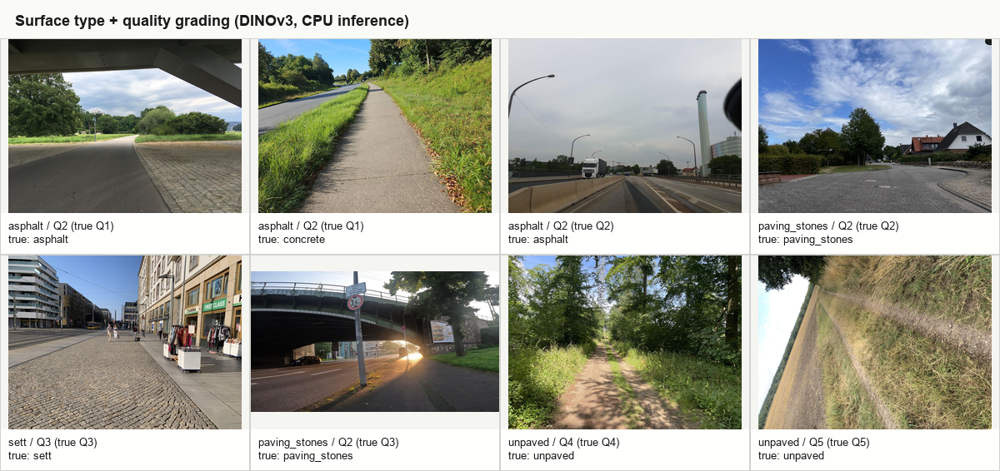
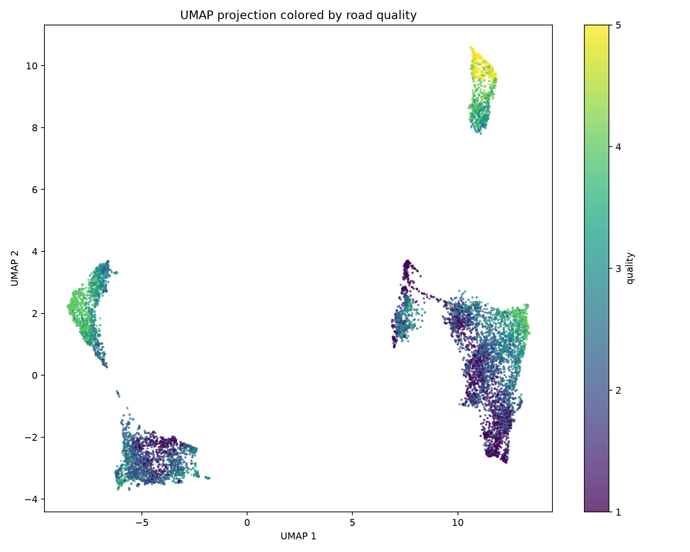
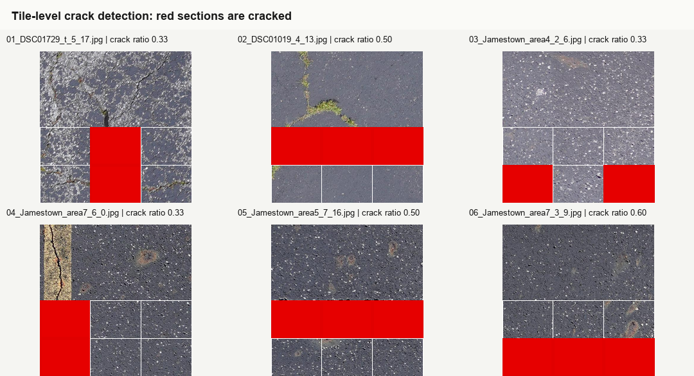
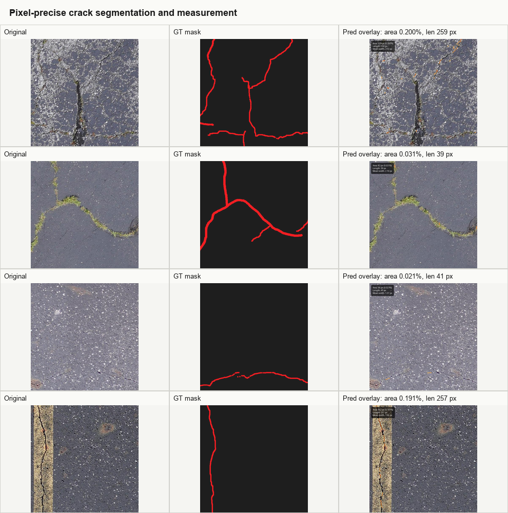
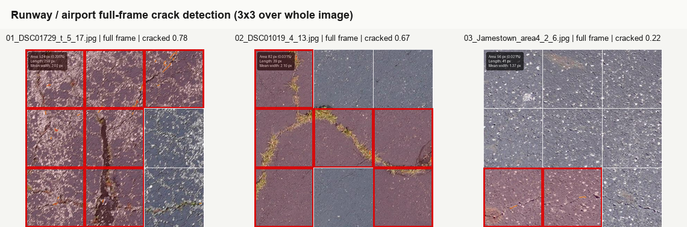
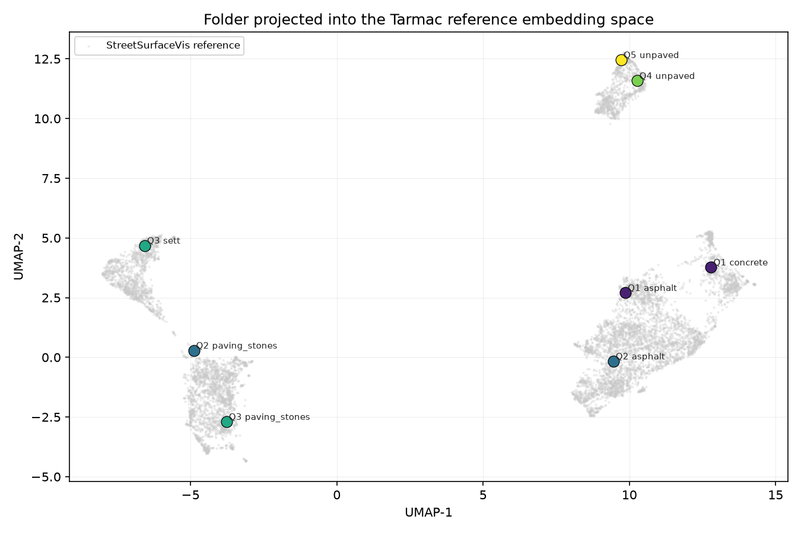
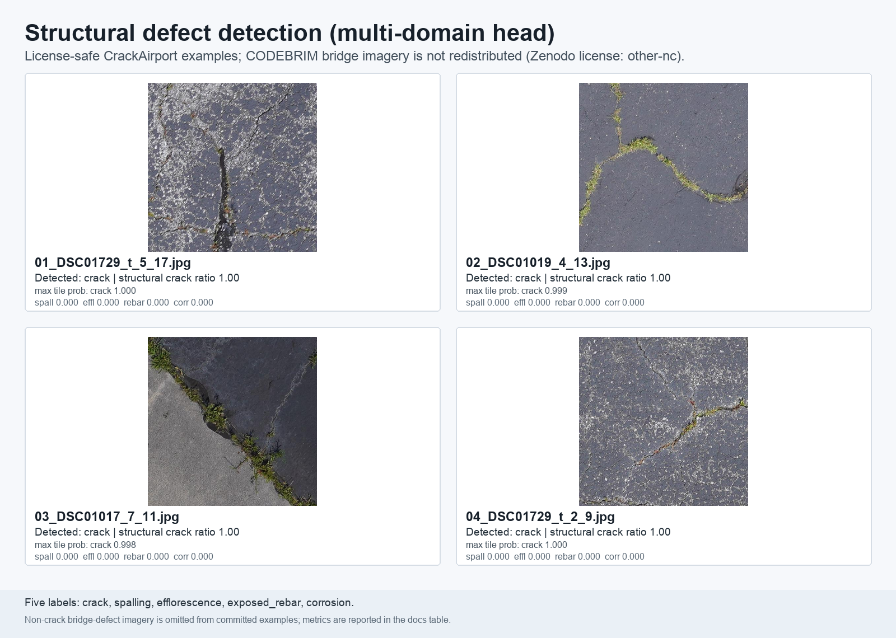

# Tarmac Results and Capabilities Gallery

This gallery shows the current Tarmac pipeline on small, license-safe examples: StreetSurfaceVis images for surface type and 1-5 quality grading, and CrackAirport airport-pavement images/masks for crack detection and segmentation. All example inference here was run on CPU (`--device cpu`) to avoid GPU contention with training.

## 1. Surface Type + Quality Grading (DINOv3)

`tarmac analyze --device cpu` embeds each image/tile with the active fine-tuned DINOv3 backbone, then classifies by cosine k-NN against the reference set. The montage spans StreetSurfaceVis validation/test examples across quality grades 1-5 and multiple surface types; labels show `pred type / predQ (trueQ)`.

Metric: held-out StreetSurfaceVis surface-type accuracy **0.954**, quality off-by-one **0.999**, and quality MAE about **0.33-0.34**.

## 2. Quality Embedding Space

The fine-tuned embedding space separates quality grades much more cleanly than the frozen backbone: excellent and very-bad surfaces move into more coherent neighborhoods instead of being smeared across the projection. This separation is what makes the cosine nearest-neighbor quality vote reliable on new folders.

Metric: fine-tuning raises quality macro-F1 from roughly **0.47-0.49** frozen to about **0.66**, while keeping almost every quality error within one adjacent grade.

## 3. Crack Detection (Tile-Level)

The crack head runs on the same DINOv3 tile embeddings and flags cracked sections independently from the 1-5 quality grader. This example forces a 3x2 lower-half tile layout and marks cracked tiles in red, matching the report's "cracked sections" view.

Metric: current crack-head test metrics are tracked in `reports/CRACK_DETECTION.md`; this run flagged cracks in **6 of 7** CrackAirport examples with a mean tile crack ratio of **0.371**.

## 4. Pixel-Precise Crack Segmentation + Measurement

`tarmac crack-measure --device cpu` produces full-resolution crack overlays and geometry measurements. The panel compares each original CrackAirport image with its available ground-truth mask and Tarmac's predicted overlay annotated with area percent and skeleton length.

Metric: mean predicted `crack_area_pct` across the shown original images is **0.111%**; CrackAirport ground-truth masks are available beside each image for comparison.

## 5. Runway / Airport Full-Frame Crack Detection

Top-down airport pavement should not be cropped to the road-like lower half. `tarmac analyze --region full --device cpu` uses the full image, here shown with a 3x3 whole-frame tile grid plus crack segmentation overlay.

Metric: the full-frame run analyzed **3** CrackAirport images with mean tile crack ratio **0.556** and frame-level cracks detected in **3/3** images.

## 6. Folder Vector-Space Visualization

`tarmac visualize` projects a folder into the persisted reference UMAP space and writes a click-to-view HTML scatter where each new dot opens the source image and prediction details. The static image above shows the same idea for the selected StreetSurfaceVis gallery folder; the interactive HTML version is regenerable locally with `tarmac visualize <folder>` (these heavy HTML reports are not committed to keep the repo lean).

Metric: folder points are embedded with the active DINOv3 model and transformed into the persisted reference space, so their position can be compared directly with the StreetSurfaceVis reference cloud.

## 7. Structural Defect Detection (Multi-Domain)

The structural defect head is a five-label classifier for `crack`, `spalling`, `efflorescence`, `exposed_rebar`, and `corrosion`. The committed visual uses CrackAirport CC BY 4.0 imagery only: CODEBRIM bridge imagery is not redistributed because Zenodo record `2620293` reports license id `other-nc`, which is not clearly permissive for committed examples. Non-crack bridge-defect evidence is therefore shown as metrics rather than images.

Headline test AP / F1:

| Label | AP | F1 |
| --- | ---: | ---: |
| crack | 0.987 | 0.939 |
| spalling | 0.966 | 0.895 |
| efflorescence | 0.968 | 0.933 |
| exposed_rebar | 0.986 | 0.959 |
| corrosion | 0.898 | 0.851 |

Test per-domain F1:

| Domain | Macro F1 | Micro F1 | Label coverage |
| --- | ---: | ---: | --- |
| overall | 0.916 | 0.930 | 5 labels |
| bridge | 0.898 | 0.890 | 5 labels |
| building | 0.877 | 0.863 | crack only |
| concrete_generic | 0.999 | 0.999 | crack only |
| pavement | 0.900 | 0.854 | crack only |
| runway | 0.899 | 0.959 | crack only |

Caveat: bridge is the only domain with all five labels, including the non-crack structural defects; the other domains are crack-only in this evaluation slice. Corrosion is the weakest label by AP and F1, so field use should treat it as the first target for more data and calibration.

## 8. Mobile (YOLO) — see `reports/YOLO_MOBILE.md`

The mobile track trains compact YOLO students for crack segmentation and type/quality classification while keeping DINOv3 as the high-accuracy teacher/server model. Current benchmark headlines are approximately **47 FPS CPU / 295 FPS MPS** for segmentation and **~240 FPS CPU** for classification; a full-training refresh is in progress.

No YOLO training or YOLO inference was run for this gallery to avoid interfering with the active GPU training job.

## Attribution and Licensing

Committed example PNGs use license-safe source imagery only. CrackAirport: Mendeley dataset `3v5r2fxf89`, **CC BY 4.0**. StreetSurfaceVis: Zenodo record `11449977`. CODEBRIM imagery is not committed; Zenodo record `2620293` currently reports license id `other-nc`.
